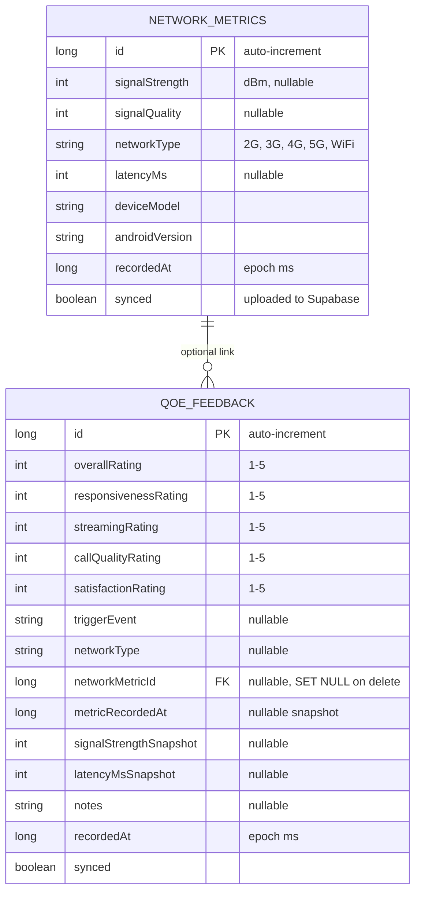
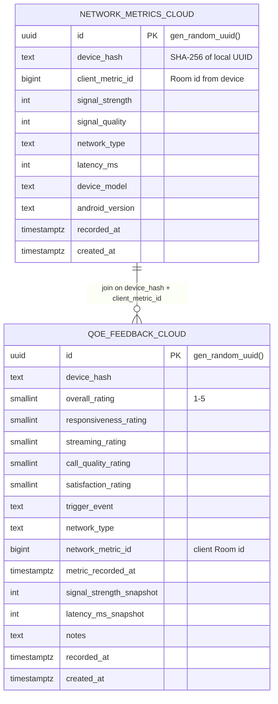
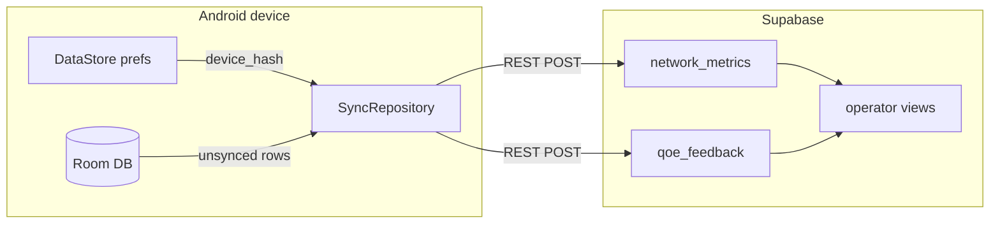

# NetLinq — Entity Relationship Diagram

**Project:** NetLinq (Internet Programming, Group 23)  
**Purpose:** Backend sprint reference — local Room schema, Supabase cloud schema, and how they relate  
**Last updated:** June 2026

---

## 1. Overview

NetLinq uses an **offline-first** data model:

1. **DataStore** — device identity and user preferences (not synced)
2. **Room (SQLite)** — local cache on the phone; source of truth while offline
3. **Supabase (PostgreSQL)** — cloud store for anonymized uploads and operator analytics

The mobile app never stores personal identifiers. A random UUID is hashed to `device_hash` before any cloud upload.

---

## 2. Local database (Room — on device)



**Relationship:** `qoe_feedback.networkMetricId` → `network_metrics.id` (optional).  
When a user rates after a network event, the feedback row points to the reading that triggered it. Snapshots are also copied so context survives if the metric is purged locally after sync.

**Files:** `data/local/entity/`, `data/local/dao/`, `NetLinqDatabase.kt` (version 3)

---

## 3. Cloud database (Supabase — PostgreSQL)



**Join rule (same device only):**

```sql
qoe_feedback.network_metric_id = network_metrics.client_metric_id
AND qoe_feedback.device_hash = network_metrics.device_hash
```

Cloud tables use **UUID** primary keys. The app sends the local Room `id` as `client_metric_id` on metrics and as `network_metric_id` on feedback so operators can correlate ratings with readings per anonymous device.

**Schema file:** `docs/supabase/schema.sql`  
**Migration (older projects):** `docs/supabase/migration_v1_linking.sql`

---

## 4. Device preferences (DataStore — not in ER tables)

| Key | Type | Purpose |
|-----|------|---------|
| `device_id` | String (UUID) | Anonymous local identity; hashed before upload |
| `onboarding_complete` | Boolean | Routing + sync bootstrap |
| `monitoring_enabled` | Boolean | Background collection on/off |
| `wifi_only_sync` | Boolean | WorkManager network constraint |
| `feedback_frequency` | Int | Prompt cooldown (5 / 15 / 30 min) |
| `trigger_*` | Boolean | Which events trigger feedback prompts |
| `theme_mode` | Int | System / Light / Dark |

**File:** `data/preferences/AppPreferences.kt`

---

## 5. Data flow (sync path)



1. Collectors write to **Room** with `synced = false`
2. **WorkManager** (`SyncWorker`) or manual Sync runs `SyncRepository.syncAll()`
3. Payloads include `device_hash` and linking fields
4. On success, rows marked `synced = true`; records older than 7 days purged locally
5. **Operator views** aggregate cloud data (no raw `device_hash` in consumer-facing reports planned for web dashboard)

---

## 6. Operator analytics views (Supabase)

| View | Purpose |
|------|---------|
| `operator_qoe_summary` | Hourly avg overall rating by network type |
| `operator_network_quality` | Hourly avg latency and signal by network type |
| `operator_feedback_with_context` | Feedback joined to linked metric reading |

These support **FR11** on a future authenticated web dashboard; the mobile app does not expose them.

---

## 7. Security model

| Layer | Mechanism |
|-------|-----------|
| Identity | UUID → SHA-256 `device_hash`; no name/email/phone |
| Transport | HTTPS (Retrofit + OkHttp) |
| Supabase | Row Level Security — `anon` role **INSERT only** on both tables |
| Mobile | No operator or admin UI in subscriber app |

---

## 8. Presentation talking points (ER diagram slide)

1. **Two stores, one model** — Room mirrors Supabase logically; cloud adds UUID PKs and `device_hash`
2. **Feedback links to readings** — FK locally; `(device_hash, client_metric_id)` join in cloud
3. **Offline-first** — `synced` flag on both tables; app works without network
4. **Anonymous by design** — DataStore UUID never leaves the device; only hash is uploaded
5. **Operator data is derived** — SQL views aggregate; no PII in analytics layer
