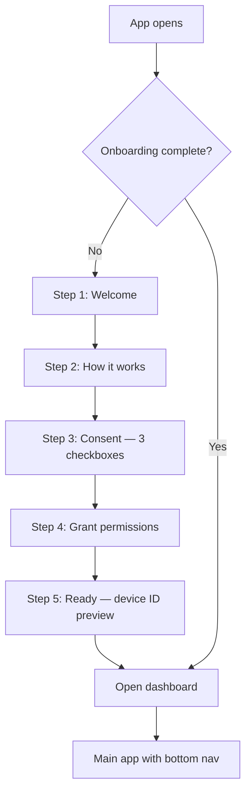
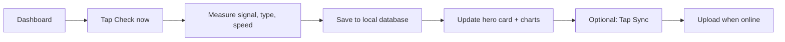
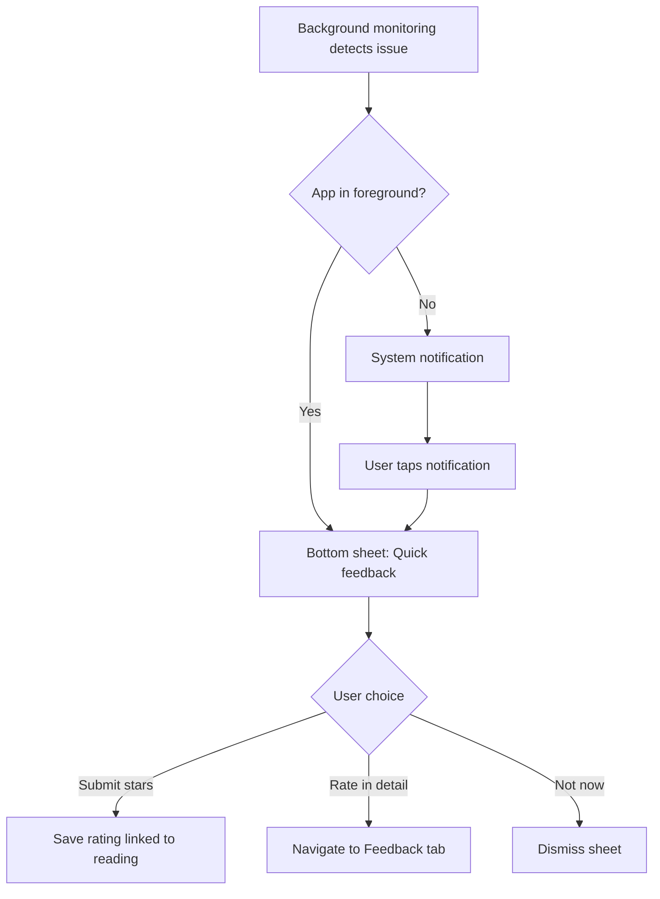
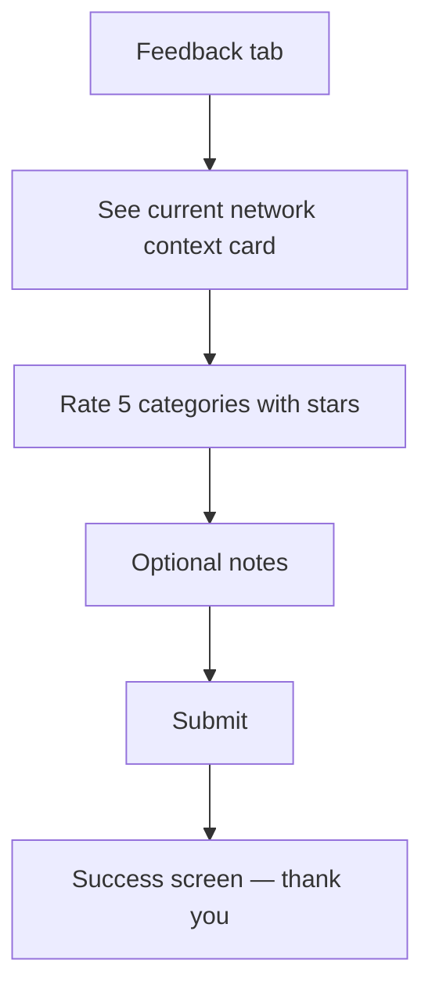

# NetLinq — UI/UX Design Document

**Project:** NetLinq (Internet Programming, Group 23)  
**Platform:** Native Android (Jetpack Compose, Material 3)  
**Audience:** Mobile subscribers in Cameroon — non-technical everyday users  
**Purpose:** UI/UX report companion — design choices, user flows, and screen rationale  
**Last updated:** June 2026

---

## 1. Product context

NetLinq helps people understand and report how their mobile internet really feels. The app does two things in parallel:

1. **Automatic checks** — the phone measures signal, connection type, and speed in the background.
2. **Your ratings** — the user gives quick star ratings when things go wrong or when they choose to.

There is **no sign-up, no login, and no personal profile**. Privacy is part of the product, not an afterthought.

This document explains **why** the interface is structured the way it is, and **how** users move through it.

---

## 2. Target users and design goals

### 2.1 Who we designed for

| User | Need |
|------|------|
| Mobile subscriber | Know if their network is good or bad right now |
| Non-technical user | Understand the app without jargon (no “QoE”, “latency”, “objective/subjective”) |
| Privacy-conscious user | Trust that no name, email, or phone number is collected |
| Occasional contributor | Rate their experience in under 30 seconds |

### 2.2 UX goals

| Goal | Design response |
|------|-----------------|
| Clarity | Every screen has a title + one-line subtitle |
| Trust | Onboarding explains permissions and anonymous ID before monitoring starts |
| Speed | Quick rating sheet with one tap-to-rate flow; full form optional |
| Scannability | Cards, badges, and colour-coded quality instead of raw numbers alone |
| Control | Settings for monitoring, triggers, sync, appearance, and feedback frequency |
| Inclusivity | Light and dark themes; large touch targets; screen reader labels on key controls |

---

## 3. Core design decisions

### 3.1 No account — anonymous setup instead of login

**Choice:** Replace “login/setup screens” from the SRS with a 5-step onboarding flow. No username or password.

**Why:**
- Lowers friction for Cameroon mobile users who may not want another account.
- Matches privacy-by-design: only a random device ID is stored locally, hashed before any upload.
- Onboarding becomes the trust-building moment, not a gate.

**UX implication:** Step 5 shows a short device ID preview so users know the app is working, without exposing full technical detail.

---

### 3.2 Plain language over technical terms

**Choice:** Avoid academic and engineering vocabulary in all user-facing copy.

| Avoid | Use instead |
|-------|-------------|
| Objective / subjective | Automatic readings / your ratings |
| QoE | How your internet feels |
| Latency | Speed / response time |
| dBm | Strong / OK / Weak signal |
| Anonymized | Without your name |
| Em dashes in body copy | Short sentences with commas or full stops |

**Why:** The SRS audience includes operators and engineers; the **mobile app audience** is everyday phone users. Confusing language reduces participation and trust.

---

### 3.3 Two feedback paths — quick vs detailed

**Choice:** Offer both a **modal quick rating** (1 overall score) and a **full Feedback tab** (5 categories + notes).

**Why:**
- Event prompts (signal drop, slow internet) need a fast answer — interrupting the user as little as possible.
- Research and coursework requirements (SRS FR2) need richer subjective data when the user has time.

**UX implication:**
- Quick sheet: stars + Submit / Rate in detail / Not now
- Full form: disabled Submit until all five categories are rated

---

### 3.4 Cards and colour for network quality

**Choice:** Hero dashboard card + quality badges (Good / Fair / Poor) + coloured stat chips.

**Why:**
- Raw numbers (-90 dBm, 490 ms) mean little to most users.
- Colour gives an instant read: green = fine, amber = OK, red = poor.
- Rounded cards create visual hierarchy on a single scrolling dashboard.

**Empty state:** When no reading exists yet, the hero card is centred with “Tap Check now below” — no confusing placeholder badge.

---

### 3.5 Bottom navigation for the main app

**Choice:** Four persistent tabs after onboarding.

| Tab | Role |
|-----|------|
| Dashboard | Right now — latest reading and actions |
| History | Over time — trends and past ratings |
| Feedback | Voluntary detailed rating |
| Settings | Control and privacy |

**Why:** Familiar Android pattern; each tab maps to one mental model (now / past / rate / control). Primary actions stay on Dashboard; Settings is not overloaded with analytics or debug tools.

---

### 3.6 Appearance control in Settings

**Choice:** User-selectable **System default**, **Light**, or **Dark** theme.

**Why:** Users expect theme control on modern Android apps. System default respects OS preference; explicit Light/Dark supports personal preference and accessibility (e.g. bright outdoor use vs low-light use).

---

### 3.7 No debug or operator UI in the subscriber app

**Choice:** Remove preview prompts, operator analytics demo, and other developer-only entry points from the consumer UI.

**Why:** End users should never see test harnesses or mock operator dashboards. Operator analytics belongs on a future authenticated web dashboard (SRS FR11), not on the subscriber phone.

---

### 3.8 Linking ratings to a specific network moment

**Choice:** When a user rates (prompt or manual submit), the app stores a **link to the exact network reading** (ID, timestamp, signal, speed snapshot).

**Why:** A rating without context (“4G felt bad”) is too vague for meaningful analysis. Linking feedback to the reading taken at that moment supports trustworthy data for operators later.

**UX implication:** Feedback screen shows live context (e.g. “4G, weak signal, 490 ms”). History shows which reading a rating was tied to.

---

## 4. Information architecture

```
NetLinq
├── Onboarding (first launch only)
│   ├── Welcome
│   ├── How it works
│   ├── Your consent
│   ├── App permissions
│   └── Ready → Open dashboard
│
└── Main app (bottom navigation)
    ├── Dashboard
    ├── History
    ├── Feedback
    └── Settings
        ├── Monitoring & sync
        ├── Prompt triggers
        ├── Feedback frequency
        ├── Appearance (System / Light / Dark)
        └── Privacy summary
```

**Overlay (not a tab):** Quick rating bottom sheet — appears on network events (foreground) or via notification tap (background).

---

## 5. User flows

### 5.1 First launch — onboarding



**Step gating:**
- Continue disabled on Consent until all three boxes are checked.
- Continue disabled on Permissions until Android permissions are granted.
- Back available from step 2 onward.

**Spacing:** Top padding respects the status bar so step labels are not squashed under the system clock.

---

### 5.2 Daily use — check network



**Primary action:** Check now (filled teal button)  
**Secondary action:** Sync (outlined button)

---

### 5.3 Event-triggered rating (in app)



**Trigger types (plain labels in Settings):**
- Signal drop
- Network change (2G / 3G / 4G / 5G / WiFi)
- Slow internet
- Connection loss

**Frequency cooldown:** Less often (30 min) / Normal (15 min) / More often (5 min) between prompts.

---

### 5.4 Voluntary detailed feedback



Submit stays disabled until all five star rows have a rating.

---

## 6. Design system

### 6.1 Colour palette

| Role | Light mode | Dark mode | Usage |
|------|------------|-----------|--------|
| Primary (brand) | Teal `#0D9488` | Teal `#5EEAD4` | Buttons, icons, active accents |
| Background | Slate `#F8FAFC` | Slate `#0F172A` | Screen background |
| Surface (cards) | White | Slate `#1E293B` | Cards, hero areas |
| Text primary | Slate `#0F172A` | Slate `#F8FAFC` | Headlines, values |
| Text secondary | Slate `#475569` | Slate `#94A3B8` | Subtitles, descriptions |
| Good | Green `#22C55E` | Same | Quality badge, strong signal |
| Fair | Amber `#F59E0B` | Same | OK quality |
| Poor | Red `#EF4444` | Same | Weak signal, slow speed |

Hero cards use a subtle **teal gradient** at the top to draw attention without clutter.

---

### 6.2 Typography

**Font:** System default (Roboto on most devices) — familiar, no extra download size.

| Style | Size | Weight | Use |
|-------|------|--------|-----|
| Headline large | 32sp | Bold | App name (onboarding) |
| Headline medium | 26sp | Bold | Hero values (e.g. “4G”, “Tap Check now below”) |
| Title large | 20sp | SemiBold | Screen section titles |
| Title medium | 16sp | SemiBold | Card titles |
| Body large / medium | 16 / 14sp | Normal | Descriptions, card body |
| Label large / medium | 14 / 12sp | Medium | Badges, step labels, captions |

---

### 6.3 Layout and spacing

| Element | Value |
|---------|--------|
| Screen horizontal padding | 20–24 dp |
| Top safe area | Status bar padding on all main screens |
| Section vertical gap | 16–20 dp |
| Card corner radius | 20 dp |
| Card elevation | 3 dp |
| Pill badge radius | Fully rounded (50 dp) |
| Bottom navigation | Material 3 — 4 items |

---

### 6.4 Shared components

| Component | Purpose |
|-----------|---------|
| **NetLinqCard** | Grouped content with elevation |
| **SectionHeader** | Title + optional subtitle for every screen |
| **QualityBadge** | Good / Fair / Poor pill |
| **MetricStatChip** | Signal, Speed, Type in hero card |
| **StarRatingBar** | 5 stars in quick prompt |
| **StarRatingRow** | Label + description + stars in full form |
| **TrendChartPlaceholder** | Bar chart for speed over time |
| **StepIndicator** | Onboarding progress (5 segments) |

---

### 6.5 Quality display logic (user-facing)

Signal and speed are scored internally, then shown as **Good / Fair / Poor** badges — not as raw engineering units on the main hero.

| Reading | Good | Fair | Poor |
|---------|------|------|------|
| Signal strength | Strong | OK | Weak |
| Speed (ms) | Under 100 ms | 100–300 ms | Over 300 ms |
| Overall hero badge | Worst of signal + speed | | |

---

## 7. Screen specifications

### 7.1 Onboarding

| Step | Title | Purpose | Key elements |
|------|-------|---------|--------------|
| 1 | Welcome | Introduce app and no sign-up | Cell tower icon, highlight card |
| 2 | How it works | Explain automatic checks + ratings | Four feature cards |
| 3 | Your consent | Explicit opt-in (SRS 8.1) | Three required checkboxes |
| 4 | App permissions | Explain each Android permission | Phone, location, notifications, network |
| 5 | Ready | Confirm setup | Device ID preview, Open dashboard |

**Navigation:** Continue (primary) + Back (outline) where applicable.

---

### 7.2 Dashboard

| Section | Content |
|---------|---------|
| Header | “Network dashboard” + subtitle about automatic readings |
| Hero card | Empty: centred “Tap Check now below”; Filled: network type, quality badge, signal/speed/type chips |
| Actions | Check now + Sync |
| Status line | Last action result (saved, sync result) |
| Pending upload | Card when unsynced readings exist |
| Speed trend | Bar chart of recent readings |
| Recent readings | Compact list with time and quality |
| Info card | Explains quick rating prompts (no debug links) |

---

### 7.3 History

| Section | Content |
|---------|---------|
| Header | “Your history” — readings and ratings over time |
| Average satisfaction | Shown when ratings exist |
| Speed trend | Bar chart |
| Signal trend | Bar chart |
| Network type distribution | Percentage bars by connection type |
| Recent feedback | Time, trigger, linked network context, score |
| Recent readings | Time, type, speed, quality badge |

**Data source:** Local storage only — no live cloud fetch on this screen.

---

### 7.4 Feedback (full form)

| Section | Content |
|---------|---------|
| Header | “Rate your experience” — under 30 seconds |
| Context card | Current network reading in plain language |
| Rating cards | Overall, responsiveness, streaming, calls, satisfaction |
| Notes | Optional free text |
| Submit | Full-width primary button |

**Success state:** Check icon, thank-you message, brief explanation of why ratings help.

---

### 7.5 Quick rating sheet (modal)

| Element | Content |
|---------|---------|
| Header | “Quick feedback” |
| Trigger card | Icon, reason (e.g. “Signal dropped”), network detail |
| Stars | Single overall rating |
| Actions | Submit · Rate in detail · Not now |

Slides up from bottom (Material bottom sheet). Dismissible.

---

### 7.6 Settings

Sections appear in priority order (appearance is not top):

| Order | Section | Controls |
|-------|---------|----------|
| 1 | Monitoring & sync | Network monitoring on/off; WiFi-only upload |
| 2 | Triggers | Signal drop, network change, slow internet, connection loss |
| 3 | Feedback frequency | Less often / Normal / More often |
| 4 | Appearance | System default / Light / Dark |
| 5 | Privacy | Short summary — no personal data, scrambled ID |

No debug previews or operator demo in the subscriber UI.

### 7.7 Bottom navigation

| Element | Design |
|---------|--------|
| Component | Custom `NetLinqBottomBar` (not default Material purple tint) |
| Background | Surface colour — matches cards |
| Selected state | Teal icon/text + soft teal pill indicator |
| Dashboard tab | Cell tower icon (brand tie-in) |

---

## 8. Notifications (UX perspective)

When the app is **in the background** and a network issue is detected, the user sees a **local system notification** (not remote push from a server).

| Element | Behaviour |
|---------|-----------|
| Title | Plain trigger name (e.g. “Internet slowed down”) |
| Body | Short explanation or detail |
| Tap | Opens app and shows the same quick rating sheet |
| Channel | “Network feedback” — user can disable in Android settings |

Onboarding requests notification permission on Android 13+ so this flow can work.

---

## 9. Accessibility and responsive behaviour

| Area | Approach |
|------|----------|
| Touch targets | Star rows 36–40 dp; standard Material switches |
| Screen readers | Content descriptions on nav tabs, sync/check actions, settings switches |
| Colour | Quality not conveyed by colour alone — text labels (Good/Fair/Poor) always present |
| Theme | Light and dark fully styled; status bar matches background |
| Scroll | All main screens scroll vertically on small phones |
| Edge-to-edge | Status bar padding prevents content under system UI |

---

## 10. Data and UI relationship

The UI reflects **local data first**:

```
Automatic reading  →  Room (network_metrics)
User rating        →  Room (qoe_feedback) + link to reading
Dashboard/History  →  Read from Room
Sync button        →  Upload unsynced rows to Supabase (when configured)
```

Users always see **their own device history** on the phone. Operators will see **aggregated** trends on a future web dashboard — not implemented in the mobile UI.

---

## 11. Out of scope for mobile UI (v1)

| Item | Reason |
|------|--------|
| Login / sign-up screens | Anonymous model by design |
| Operator analytics on phone | Role belongs on future web dashboard |
| Remote push notifications | Local event notifications only |
| Map / GPS location UI | Location permission is for signal API only |
| Debug / preview tools | Removed from consumer-facing Settings |

---

## 12. Alignment with SRS

| SRS area | UI/UX response |
|----------|----------------|
| FR1 Anonymous ID | Onboarding step 5 preview; privacy card in Settings |
| FR2 Five rating categories | Feedback tab full form |
| FR3 Event prompts | Quick sheet + notification + trigger toggles |
| FR10 Personal dashboard | Dashboard + History tabs |
| Section 8.1 Consent | Onboarding step 3 checkboxes |
| Section 8.3 Privacy | Plain-language copy throughout; no account |

---

## 13. Summary

NetLinq’s UI is built for **everyday mobile users in Cameroon**, not network engineers. Design choices prioritise **trust** (no account, clear consent), **clarity** (plain language, cards, colour badges), and **speed** (quick rating sheet). The app separates **automatic readings** (Dashboard) from **your ratings** (prompts + Feedback tab), while linking every rating to the **specific network reading** at that moment. Light and dark themes, generous top spacing, and a four-tab shell keep the experience familiar, readable, and in the user’s control.

---

*For technical implementation detail, see `docs/IMPLEMENTATION_REPORT.txt`. For backend setup, see `docs/SUPABASE_SETUP.md`.*
